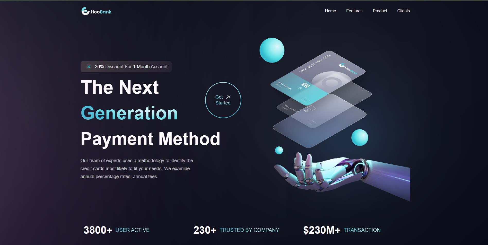

🌐 Modern UI/UX Website

A beautifully designed Modern UI/UX Landing Page built with React.js and Tailwind CSS.
This project focuses on creating a clean, elegant, and fully responsive interface that adapts perfectly across all screen sizes.

🚀 Features

⚡ React.js + Tailwind CSS — for a fast, modern, and scalable setup

💎 Beautiful UI/UX Design — clean layout with smooth visual hierarchy

📱 Fully Responsive — optimized for mobile, tablet, and desktop

🎨 Modern Animations & Styling — subtle effects that enhance user experience

🧩 Reusable Components — structured and modular React code

🌗 Consistent Design System — balanced use of colors, spacing, and typography

🛠️ Technologies Used

React.js – for building UI components

Tailwind CSS – for styling and responsive design

Vite – for fast development and build setup

📂 Project Structure
modern-uiux/
├── src/
│   ├── assets/          # Images, icons, etc.
│   ├── components/      # Reusable UI components
│   ├── sections/        # Different sections of the landing page
│   ├── App.jsx          # Main app file
│   └── main.jsx         # Entry point
├── index.html
├── package.json
└── README.md

⚙️ Installation & Setup

To run this project locally:

# Clone the repository
git clone https://github.com/iqbal-hasan-developer/Modern-UI-UX.git

# Navigate to the project folder
cd BusinessApp

# Install dependencies
npm install

# Start the development server
npm run dev

Then open http://localhost:5173
 in your browser.

🧠 What I Learned

This project helped me strengthen my understanding of:

React component structure and props

Tailwind utility classes for modern layouts

Responsive design techniques

Building and styling a complete landing page from scratch

📸 Preview

💬 Feedback

I’d love to hear your thoughts and suggestions to make it even better!
If you like the project, consider ⭐ starring it on GitHub.
